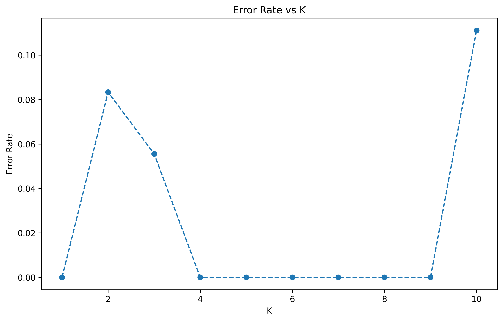
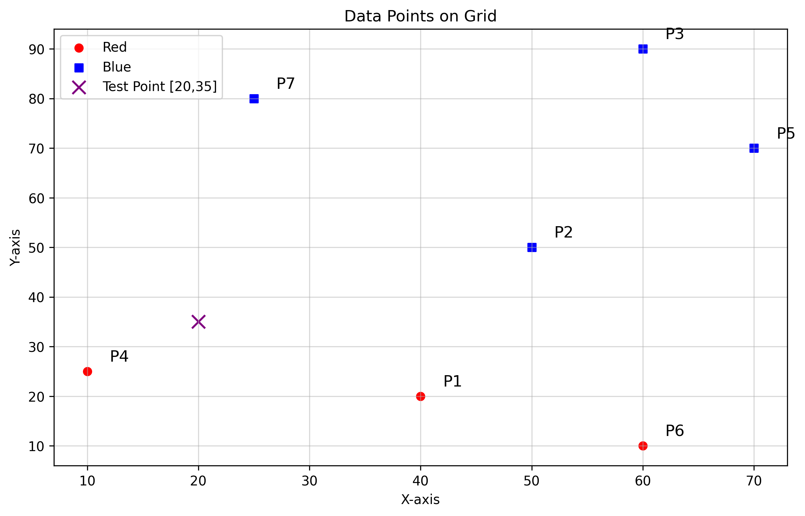
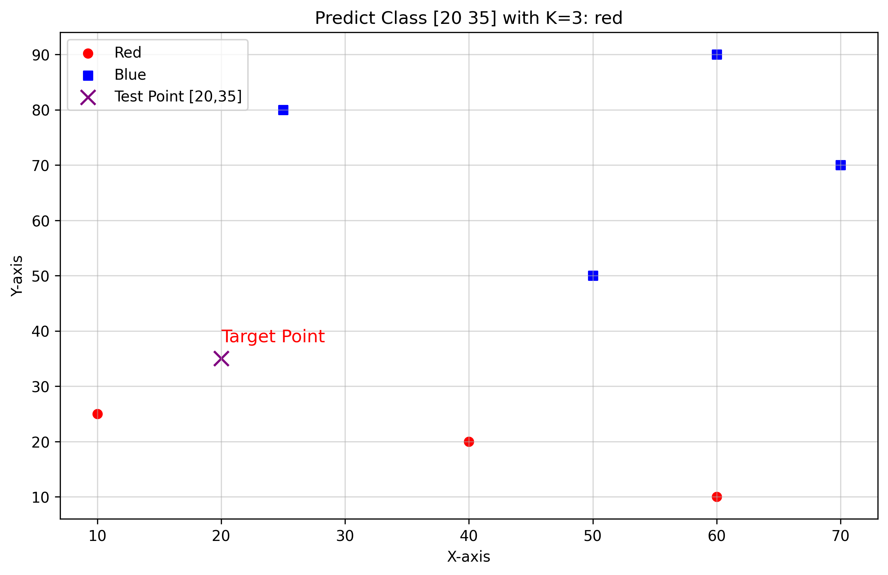
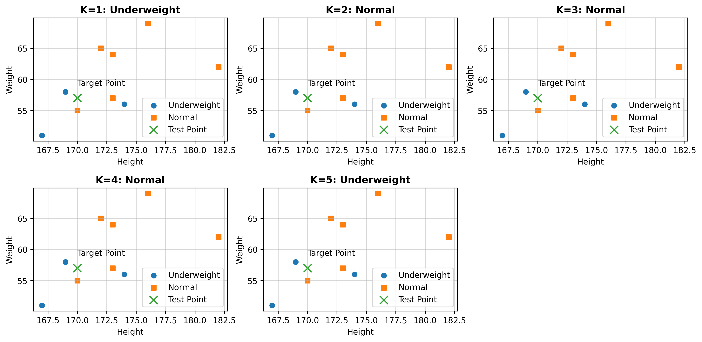
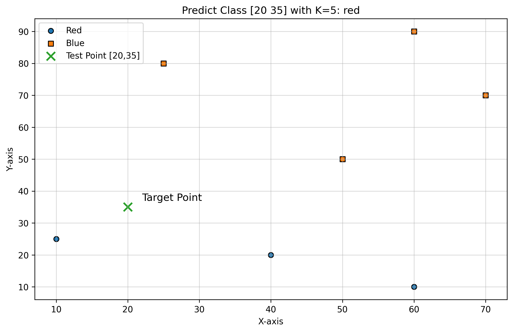

# Ch04 — KNN (k-Nearest Neighbors)

Thư mục này chứa các ví dụ về **KNN phân loại** gồm 2 nhóm:
- **Custom (tự cài đặt)**: tự tính khoảng cách Euclid và majority voting
- **Sklearn**: dùng `sklearn.neighbors.KNeighborsClassifier`

Ngoài ra có các file **ảnh kết quả** (được lưu từ matplotlib).

---

## Python files

### 1) Custom (from scratch)
- `custom_knn_predict_demo.py`  
  Dự đoán nhãn cho **một điểm test** bằng KNN tự cài đặt (tính khoảng cách Euclid + vote).

- `custom_knn_compare_k_values.py`  
  So sánh nhãn dự đoán khi thay đổi **nhiều giá trị K** (in kết quả ra terminal, không vẽ).

- `custom_knn_compare_k1_to_k5_plot.py`  
  So sánh K=1..5 cho bài toán **Underweight/Normal** và vẽ nhiều subplot (mỗi subplot là một K).

- `custom_knn_compare_k1_to_k5_plot.png` *(nếu bạn sinh ra ảnh theo tên này)*  
  Ảnh output từ file `custom_knn_compare_k1_to_k5_plot.py` (tên có thể khác tuỳ đoạn `savefig`).

- `custom_knn_classification_plot_demo.py`  
  KNN tự cài đặt + vẽ scatter cho bài toán **Red/Blue** (có điểm test và nhãn dự đoán).

- `knn_2d_classification_demo.py`  
  Demo KNN 2D (phân loại) — file minh hoạ bổ sung (cùng chủ đề, có thể dùng để luyện tập thêm).

### 2) Sklearn
- `sklearn_knn_classification_basic_demo.py`  
  Demo cơ bản: fit KNN (thường k=3) và dự đoán nhãn cho một điểm test.

- `sklearn_knn_predict_plot_demo.py`  
  Dự đoán + vẽ scatter (Red/Blue) bằng sklearn, có lưu ảnh.

- `sklearn_knn_compare_k1_to_k5_plot.py`  
  So sánh K=1..5 (Underweight/Normal) bằng sklearn, vẽ nhiều subplot (mỗi subplot là một K).

- `sklearn_knn_compare_k1_to_k5_plot2.py`  
  Phiên bản khác của so sánh K=1..5. Nếu trùng chức năng, nên giữ 1 file để repo gọn hơn.

- `sklearn_knn_cv_error_rate_vs_k.py`  
  Dùng cross-validation để tính **error rate theo K** và chọn **K tối ưu** (có vẽ biểu đồ và lưu ảnh).

---

## Images (saved outputs)
- `knn_error_rate_vs_k.png`: biểu đồ Error Rate vs K (từ file cross-validation)
- `knn_plot.png`: ảnh plot KNN (custom)
- `knn_predict_plot.png`: ảnh plot điểm test (custom)
- `sklearn_knn_compare_k1_to_k5.png`: subplot so sánh K (sklearn)
- `sklearn_knn_predict_plot.png`: plot dự đoán (sklearn)

### Error rate vs K


### Custom KNN plots




### Sklearn KNN plots




> Nếu muốn repo gọn hơn, bạn có thể chuyển toàn bộ ảnh vào `img/` hoặc `outputs/` rồi cập nhật đường dẫn `savefig()`.

---

## Chạy nhanh
```bash
pip install numpy matplotlib scikit-learn
python custom_knn_predict_demo.py
python custom_knn_classification_plot_demo.py
python sklearn_knn_cv_error_rate_vs_k.py
--------------------------------------------------------------------------------------
EN — Chapter 04 — KNN (k-Nearest Neighbors)

This folder contains KNN classification examples in two styles:

Custom (from scratch): you compute Euclidean distances manually and use majority voting to decide the class.

Sklearn: you use sklearn.neighbors.KNeighborsClassifier.

It also includes saved plot images generated by matplotlib (plt.savefig(...)).

Python files
1) Custom (from scratch)

custom_knn_predict_demo.py
Predicts the label of a single test point using a from-scratch KNN implementation (Euclidean distance + majority vote).

custom_knn_compare_k_values.py
Runs KNN prediction for multiple K values and prints the predicted labels to the console (no plotting).

custom_knn_compare_k1_to_k5_plot.py
Compares KNN results for K=1..5 on the Underweight/Normal dataset and visualizes each K in a separate subplot.

custom_knn_classification_plot_demo.py
From-scratch KNN classification with a 2D scatter plot for the Red/Blue dataset, including the test point and the predicted class.

knn_2d_classification_demo.py
An additional 2D KNN classification demo script (extra practice / alternative example).

2) Sklearn

sklearn_knn_classification_basic_demo.py
A minimal example using KNeighborsClassifier (typically k=3): fit on training data and predict the label for a test point.

sklearn_knn_predict_plot_demo.py
Uses sklearn KNN to predict and plot the Red/Blue dataset with the test point (also saves the figure).

sklearn_knn_compare_k1_to_k5_plot.py
Uses sklearn KNN to compare K=1..5 on the Underweight/Normal dataset, producing multiple subplots (one per K).

sklearn_knn_compare_k1_to_k5_plot2.py
Another version of the K=1..5 comparison. If it duplicates functionality, consider keeping only one file.

sklearn_knn_cv_error_rate_vs_k.py
Uses cross-validation to compute the error rate for each K, plots Error Rate vs K, and prints the best K (minimum error).

Images (saved outputs)

knn_error_rate_vs_k.png: Error Rate vs K plot (cross-validation)

knn_plot.png: custom KNN plot output

knn_predict_plot.png: custom KNN prediction plot output

sklearn_knn_compare_k1_to_k5.png: sklearn K comparison subplot output

sklearn_knn_predict_plot.png: sklearn prediction plot output