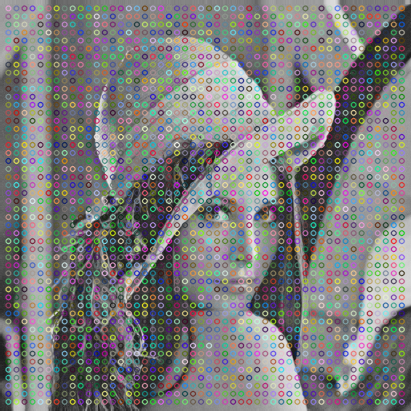
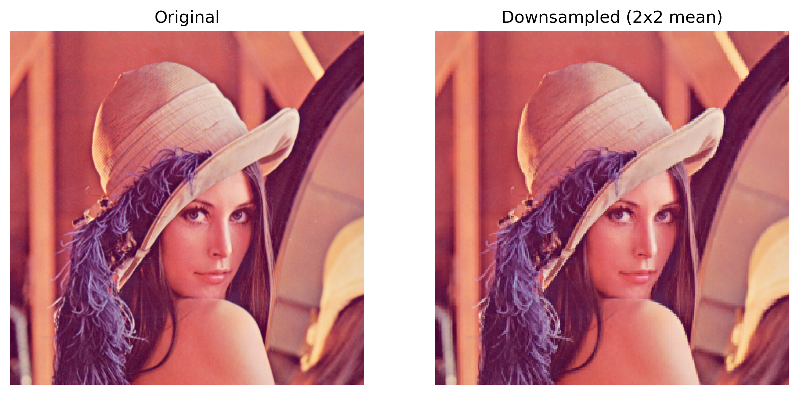
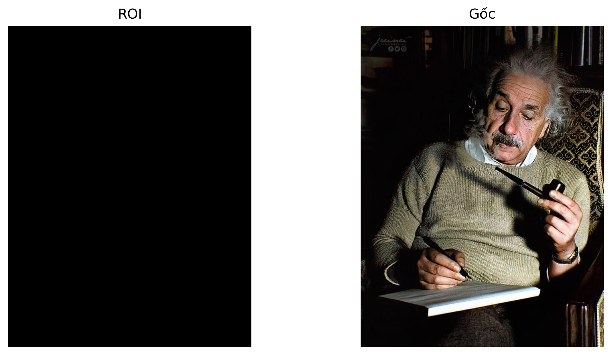
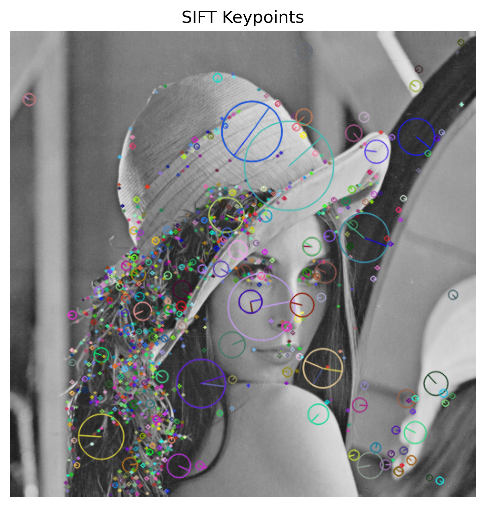

# Ch05 — SIFT & Image Operations

Thư mục này gồm các bài thực hành liên quan đến **SIFT** (tự cài đặt một phần / dùng OpenCV) và một số thao tác xử lý ảnh cơ bản (ROI, resize/downsample, ghép ảnh).

---

## Python files

### SIFT / Dense SIFT
- `opencv_sift_keypoints_plot.py`  
  Dùng **OpenCV SIFT** để detect keypoints + descriptors và vẽ keypoints lên ảnh (có lưu ảnh).

- `custom_dense_sift_manual.py`  
  Tự cài đặt **Dense SIFT** đơn giản: Sobel gradients → magnitude/orientation → histogram hướng theo từng vùng (grid), vẽ keypoints (có lưu ảnh).

- `custom_sift_orientation_histogram.py`  
  Các hàm nền tảng cho SIFT: tính gradient, magnitude/orientation và histogram hướng (36 bins) cho một vùng (region).

### ROI / Ghép ảnh / Downsample
- `extract_two_rois_mask_plot.py`  
  Cắt **2 vùng ROI** từ ảnh, đặt lên nền đen và hiển thị so sánh với ảnh gốc (có lưu ảnh).

- `image_quadrant_paste_collage_plot.py`  
  Resize ảnh và “dán” vào các góc (4 góc / cả 4 góc) rồi hiển thị dạng collage (có lưu ảnh).

- `custom_downsample_2x2_mean_filter.py`  
  Downsample ảnh bằng cách lấy block **2×2** và lấy **mean** theo từng kênh (có lưu ảnh).

---

## Images (saved outputs)

### Dense SIFT



### Downsample 2x2


### ROI extraction


### Quadrant collage


### OpenCV SIFT keypoints


---

## Chạy nhanh
```bash
pip install numpy matplotlib opencv-python
python opencv_sift_keypoints_plot.py
python custom_dense_sift_manual.py
----------------------------------------------------------------------
EN — Chapter 05 — SIFT & Image Operations

This folder contains exercises related to SIFT (OpenCV + partial manual implementations) and basic image operations (ROI extraction, downsampling, collage).

Python files
SIFT / Dense SIFT

opencv_sift_keypoints_plot.py
Detects SIFT keypoints/descriptors using OpenCV and visualizes them (saves the output image).

custom_dense_sift_manual.py
A simple manual Dense SIFT style pipeline: Sobel gradients → magnitude/orientation → orientation histograms over a grid (saves outputs).

custom_sift_orientation_histogram.py
Helper functions for gradients, magnitude/orientation, and a 36-bin orientation histogram for a region.

ROI / Collage / Downsample

extract_two_rois_mask_plot.py
Extracts two ROIs, places them on a black canvas, and visualizes vs. the original (saves the figure).

image_quadrant_paste_collage_plot.py
Resizes the image and pastes it into different quadrants/corners to form a collage (saves the figure).

custom_downsample_2x2_mean_filter.py
Downsamples the image using a 2×2 block mean per channel (saves the figure).

Embedded outputs

The images below are generated by the scripts and stored in this folder:

Dense SIFT outputs: dense_sift_gray.png, dense_sift_keypoints.png

Downsample output: downsample_2x2_mean_result.png

ROI output: roi_two_regions_result.png

Collage output: image_quadrant_paste_collage.png

OpenCV SIFT output: sift_keypoints.png