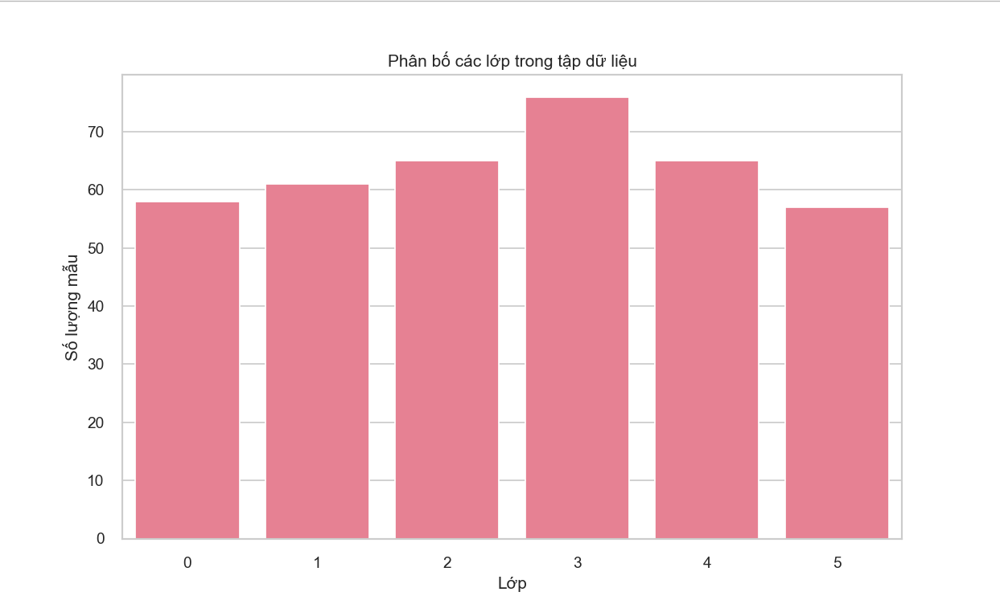
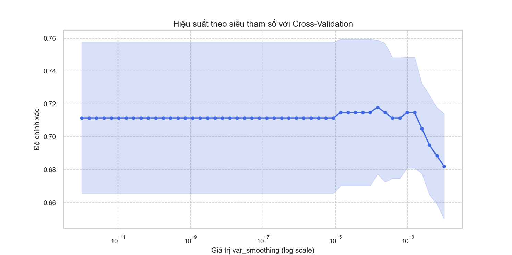
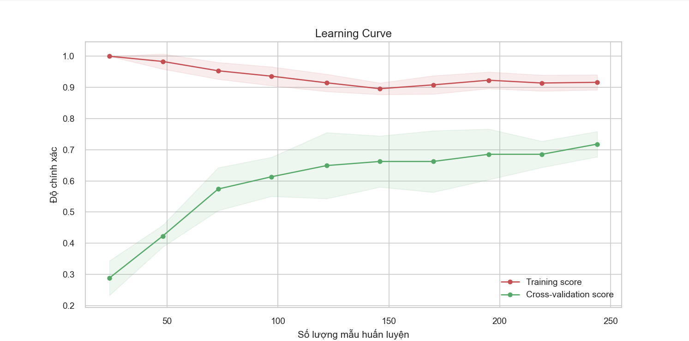
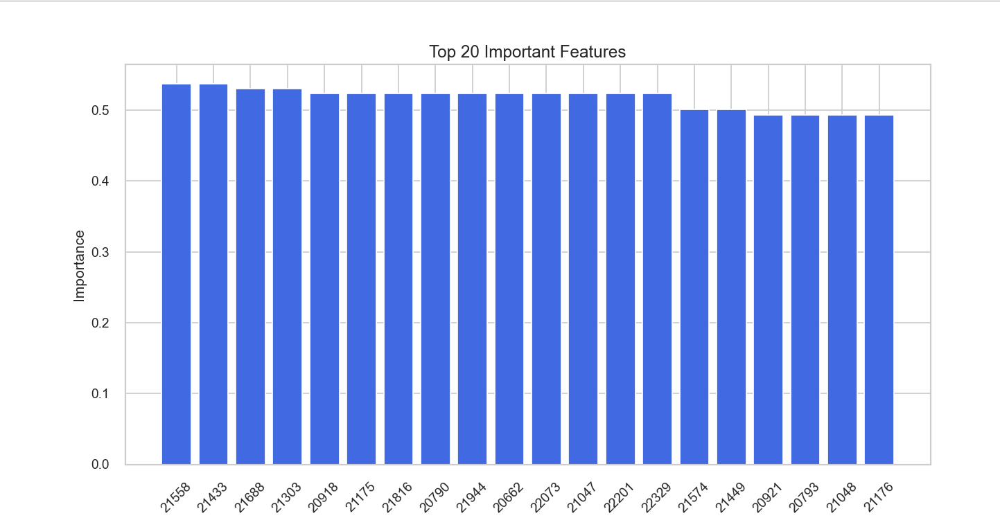
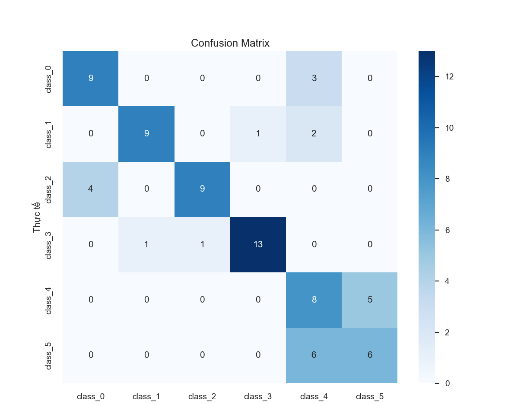
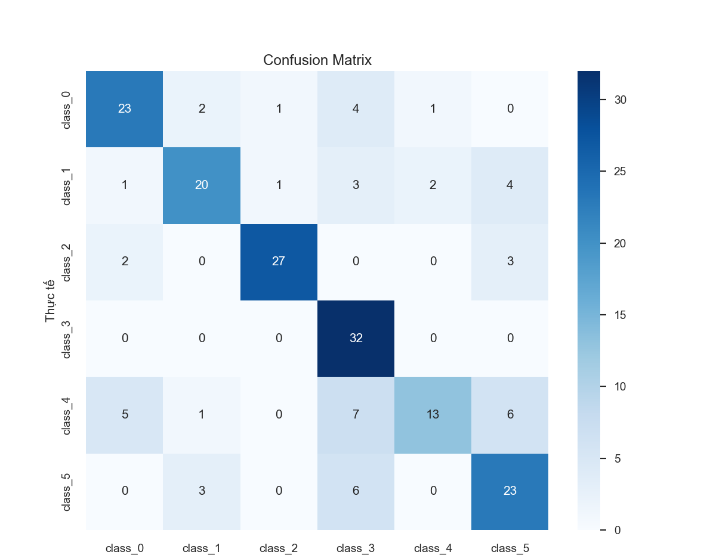

# Ch06 — Naive Bayes (Hand Gesture Classification + HOG)

Thư mục này chứa các bài thực hành **Naive Bayes** cho bài toán phân loại **hand gesture** (ảnh bàn tay).  
Có 2 hướng chính:
- **Naive Bayes với ảnh grayscale flatten** (đặc trưng pixel)
- **Naive Bayes + HOG** (trích xuất đặc trưng HOG, GridSearch tối ưu `var_smoothing`, learning curve, lưu model)

Ngoài ra có các file ảnh `.png` minh hoạ/đầu ra và được nhúng trực tiếp bên dưới.

---

## Python files

### 1) Demo/Visualization HOG
- `hog_visualization_side_by_side.py`  
  Hiển thị **ảnh gốc** và **ảnh HOG** (side-by-side) và lưu hình ra file.

### 2) Naive Bayes với pixel (flatten)
- `naive_bayes_hand_gesture_classification.py`  
  Pipeline cơ bản: đọc ảnh → preprocess → train/test → đánh giá (accuracy/report/confusion matrix/sample predictions).  
  Có lưu các biểu đồ ra thư mục hiện tại.

- `naive_bayes_hand_gesture_3_classes_show_predictions.py`  
  Chạy với **3 lớp (class_0..class_2)**, tập trung vào hiển thị dự đoán mẫu.

- `naive_bayes_hand_gesture_6_classes_show_predictions.py`  
  Chạy với **6 lớp (class_0..class_5)**, hiển thị dự đoán mẫu + in metric.

### 3) Naive Bayes + HOG (+ tối ưu)
- `naive_bayes_hog_gridsearch_plot_and_samples.py`  
  Trích đặc trưng (pixel + hog_image + HOG fd) → **GridSearch `var_smoothing`**  
  + vẽ đường cong hiệu suất + hiển thị dự đoán mẫu.

- `naive_bayes_hog_gridsearch_save_model.py`  
  HOG + GridSearch → train mô hình tốt nhất → đánh giá  
  + **lưu model `.pkl`** và lưu các hình minh hoạ.

- `naive_bayes_hog_gridsearch_learning_curve_4classes.py`  
  Phiên bản **4 lớp (class_0..class_3)** có thêm:
  - class distribution
  - hyperparameter performance curve
  - learning curve
  - confusion matrix
  - sample predictions

---

## Images (embedded)

### Class distribution / Dataset overview


### Cross-validation illustration


### Learning / performance curve illustration


### Features illustration


### Confusion matrix (example)


### Confusion matrix (variant)


> Nếu bạn chạy các script và sinh thêm ảnh như `class_distribution.png`, `confusion_matrix.png`,
> `learning_curve.png`, `sample_predictions.png`, bạn có thể thêm vào README bằng cùng cú pháp:
> ``.

---

## Cài đặt & chạy nhanh
```bash
pip install numpy matplotlib scikit-learn opencv-python seaborn pandas scikit-image joblib

-------------------------------------------------------------------------------------
EN — Naive Bayes (Hand Gesture Classification + HOG)

This folder contains Naive Bayes experiments for hand gesture image classification.
There are two main approaches:

Naive Bayes with raw pixel features (grayscale → resize → flatten)

Naive Bayes + HOG features (HOG extraction, GridSearch for var_smoothing, learning curves, model saving)

It also includes several .png images (illustrations and saved outputs).

Python files
1) HOG visualization

hog_visualization_side_by_side.py
Displays the original grayscale image and the HOG visualization side-by-side and saves the figure.

2) Naive Bayes with pixel (flatten) features

naive_bayes_hand_gesture_classification.py
Basic pipeline: load images → preprocess (grayscale/resize/flatten) → train/test split → evaluation
(accuracy, classification report, confusion matrix, sample predictions). Saves plots to the script folder.

naive_bayes_hand_gesture_3_classes_show_predictions.py
3-class version (class_0..class_2), focused on showing prediction samples in a grid + printing metrics.

naive_bayes_hand_gesture_6_classes_show_predictions.py
6-class version (class_0..class_5), same idea as above but for all classes.

3) Naive Bayes + HOG (with optimization)

naive_bayes_hog_gridsearch_plot_and_samples.py
Extracts combined features (pixel + hog_image + HOG fd) → GridSearch over var_smoothing
→ plots parameter performance curve + shows sample predictions (from the pixel part of the feature vector).

naive_bayes_hog_gridsearch_save_model.py
HOG + GridSearch → train best model → evaluate → save trained model as .pkl (joblib)
and save visual outputs.

naive_bayes_hog_gridsearch_learning_curve_4classes.py
4-class version (class_0..class_3) that additionally includes:

class distribution plot

hyperparameter performance curve

learning curve

confusion matrix

sample prediction grid
All figures are saved into the same directory as the script.